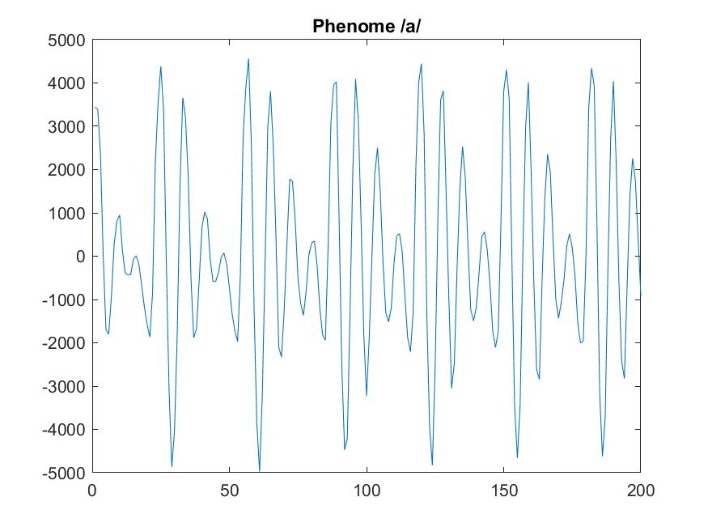
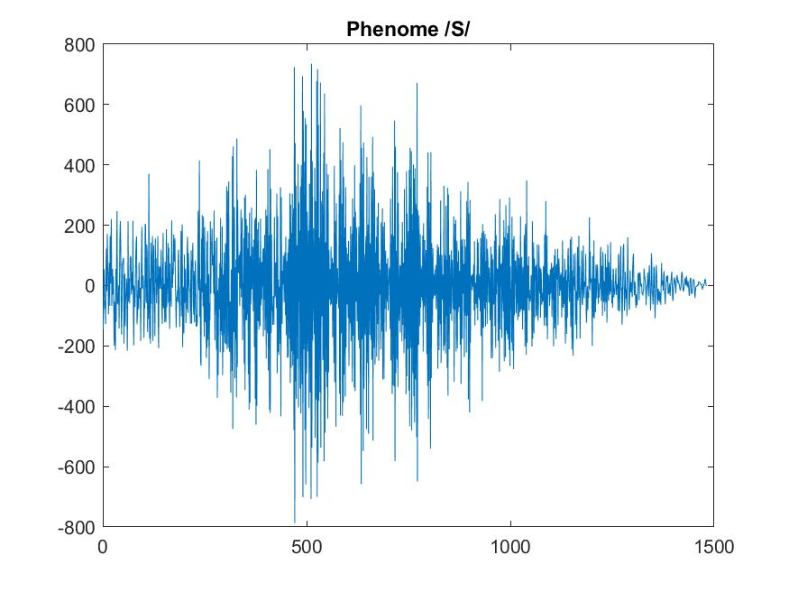
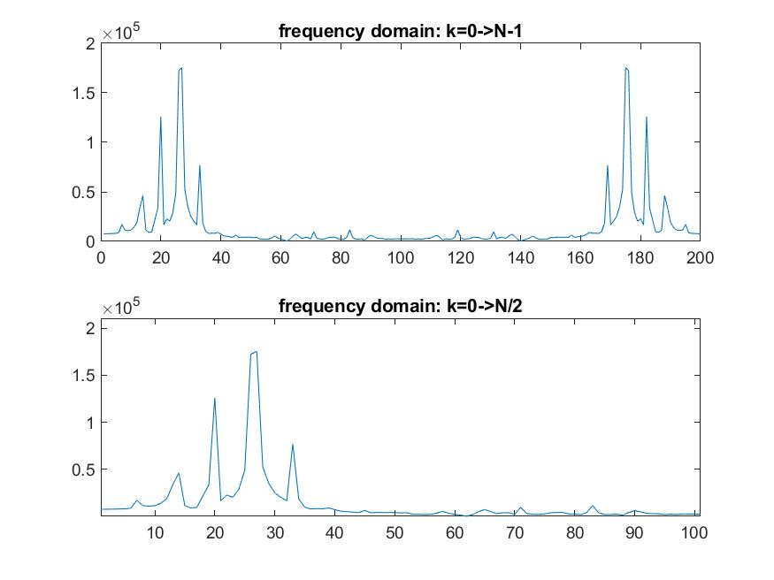
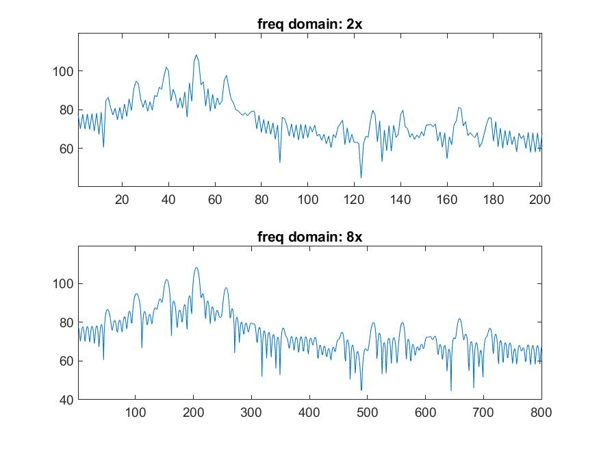

# Computer Assignemnt 1: Introduction to Frequency Analysis

$$ \text{Name: Thomas Kost UID: 504989794}$$

## Abstract

For this assignment we will be using matlab to plot and invesitgatye signals and perform basic frequency analysis techniq  ues on them. These techniques include plotting the magnitude spectrum itself, oversampling to produce greater frequnecy resolution, and performing circular convolution with the FFT. Each of these operations will be done on data containing sound bytes. This exercise will familarize us with some of the tools available through MATLAB.

## Introduction

The first thing we are asked to do is to plot the speech waveforms of the /a/ and /s/ phenomes. This is done uring the provided commands. Thge resulting images are shown in the next section. 

For the execution of the computer assignement the following script was written to ensure the entire assignement could be executed at once. 

```MATLAB
%%
 %  File: CA_1.m
 % 
 %  Author: Thomas Kost
 %  
 %  Date: 11 October 2020
 %  
 %  @brief Compute assignement for week 1. Covers problems covering basic frequency analysis
 %

 clear; clc; close all;

 %% Introduction exercise
 one;
 fig3 = figure; plot(a); title("Phenome /a/");
 fig4 = figure; plot(sh); title("Phenome /S/");
 
 saveas(fig3, "a.jpg");
 saveas(fig4, "sh.jpg");
 
 %% Part A: Implementing the Discrete Fourier Transform
 two;
 
 %% Part B: The Effects of Oversampling
 three; 
 
 %% Part C: Linear vs Circular Convolution
 
 x= [4, -1, 2];
 y_linear = conv(x,x);
 y_circular = cconv(x,x,3);
 y_fft = ifft(fft(x).*fft(x));
```

## Implementing a Discrete Fourier Transform
1. Shown below are the figures for the phenome /a/ and the phenome /sh/. 




2. The following shows the modified code of the `dft.m` file. It has been modified to perform the dft properly with the given implemnetation.

```MATLAB
function [f]=dft(x)
%
% get the size, and zero some arrays
%
N=max(size(x,1),size(x,2));
f=zeros(1,N);
real=zeros(1,N);
imag=zeros(1,N);

%
% compute the transform; the slow way
% 
% Recall that: e^jx = cos(x) + j*sin(x)
%
sprintf('starting %d-point dft...',N)
for k=0:N-1,
  for n=0:N-1,
    % Note in matlab, 'pi' is 3.14159...
    % The first element of an array is element 1, not 0
    % The next two lines must be completed/fixed
    real(k+1) = x(n+1)*cos(2*(pi/N)*k*n) + real(k+1);
    imag(k+1) = -x(n+1)*sin(2*(pi/N)*k*n)+ imag(k+1);
  end
end
sprintf('finished %d point dft',N)

%
% find the magnitude of the complex function
%
f = (real.^2 + imag.^2).^0.5;
```

3. The following image shows the magnitude spectrum of the phenome a. This spectrum is made up of several impulse like values at lower frequencies. This makes sense as speech is made up of several tones overlapping to make a sound. As a result we would expect to see several tones present that make up the sound. These peaks are fair to be approximated as tones as they are roughly similar to an impulse in the frequency domain--which is generated from a pure tone in the time domain.


4. In the case of the /a/ input signal the size of N is 200. This can be found from inspecting the variable. As the sampling frequency is 8000, we know that the frequency bin width can be calculated as follows:
$$ \Delta F = \frac{F_s}{N}= \frac{8000}{200} = 40 Hz$$

5. As the first DFT algorithm is $O(N^2)$ a vector of length 256 will require 65536 multiplications. Using the FFT algorithm we will only require 2048 multiplications. This implies that based solely on work required the FFT algorithm is 32 times more efficient than the brute force method. We can also strictly compare the computation times. According to our script, running the respective functions results in the brute force method taking $4.902*10^{-3} s$ and the FFT taking  $3.16*10^{-5}s$. This result gives us a ratio of 155.12. Suggesting the FFT algorithm as implemented in the matlab function is 155.12 times faster than the brute force method (on my machine).

## Effects of Oversampling
1. As compared to the linearly plotted graph we can see that the peaks are much less pronounced--this is due to the fact that we are now using a log scale. This reduced the difference to be a more manageable size. However, from oversampling we can see that the spectrum has become much more smooth. There are no longer large gaps present from jumping from one frequency bin to another. This gives us a much more clear description of the spectrum of the signal. We can see that the increased frequency resolution gives us more defined peaks and valleys  within the spectrum. 



2. As the zero padding goes to infinity the size of the frequency bins becomes infinitesimally small. As we approach an infinite number of zeros we approach a continuous frequency plot. 

## Linear v.s. Circular Convolution

The results of the three methods are as follows:

$$y_{linear} = [\underline{16}, -8, 17, -4, 4]$$
$$y_{circular} = [12, -4, 17]$$
$$y_{fft} = [12, -4, 17]$$

The minimum size of N required for the circular convolution to produce the same result as the linear convolution in this case is 5. This is $N+L-1$ points. 

The fft implementation of convolution executes the same operation as circular convolution. This is because the fft assumes that the signal is periodic. And so through using the fft to drag one signal across another, results in the signal being dragged across the assumed periodic portion aswell. In short, multiplication in the frequency domain of the FFT executes circular convolution because of this assumed periodicity. Becuase neither of the signals are zero padded, the signal produces a result identical to the circular convoltuion operation.
