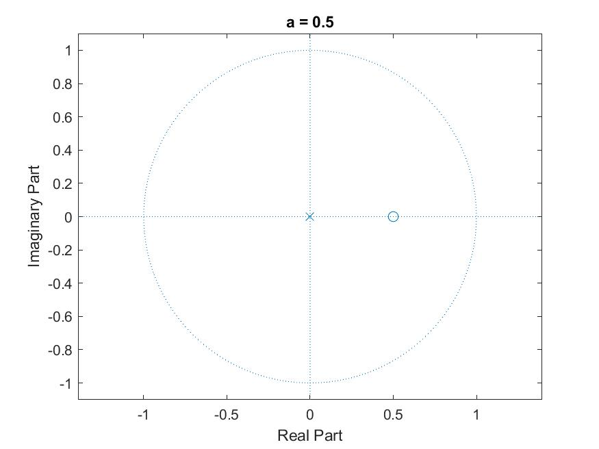
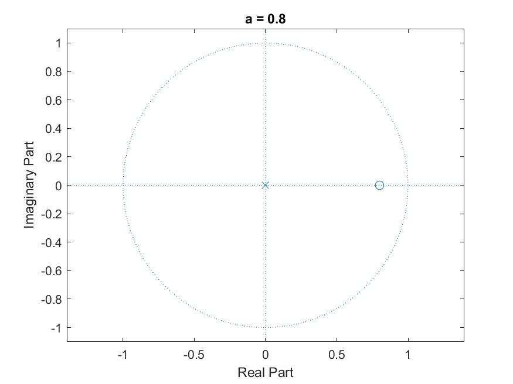
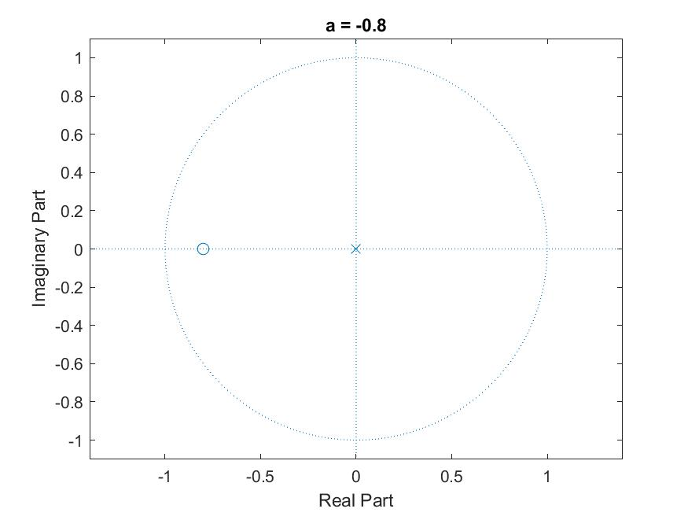
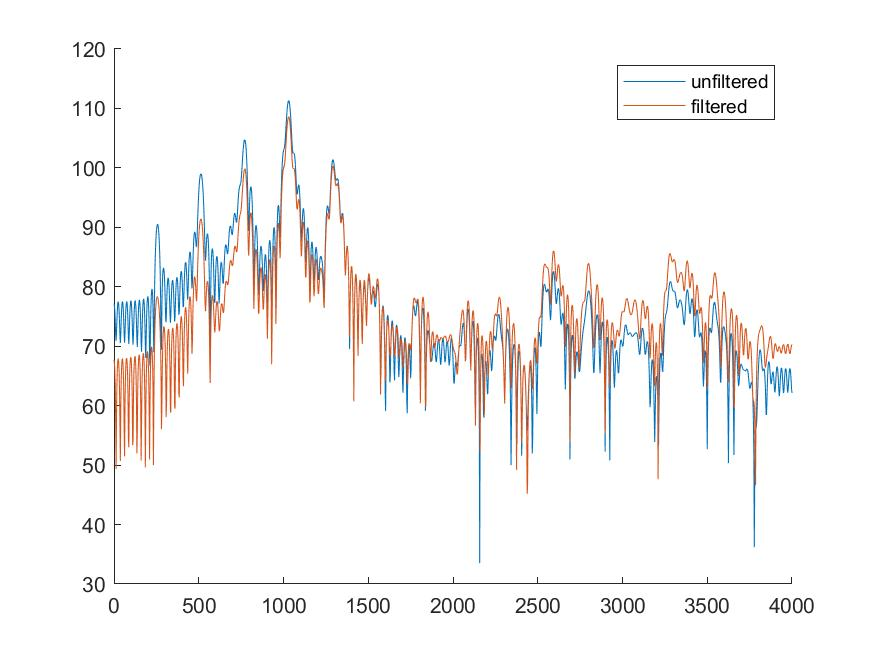
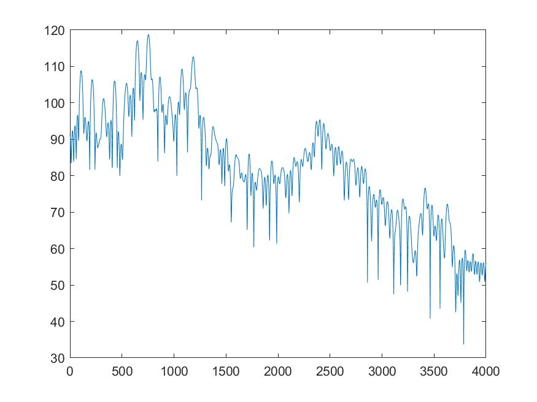
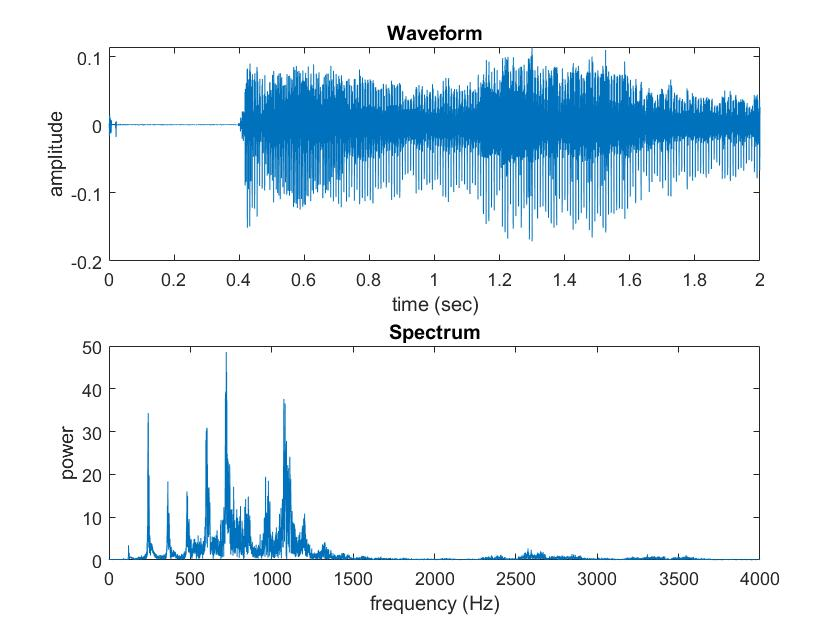

# Computer Assignmnet 2: Frequency  and Time Analysis of Speech

$$ \text{Name: Thomas Kost UID: 504989794}$$

## Abstract

In this assignement we will be using MATLAB  to learn about pre-emphasis filters, Formant Frequency Identification, and Pitch Period Estimation. Each of these sections will be described below, with the relevant questions answered.

The code for each exercise has been compiled in a file called `CA_2.m`. The code contained in this file is as is shown below:

```MATLAB
%%
 %  File: CA_2.m
 % 
 %  Author: Thomas Kost
 %  
 %  Date: 19 October 2020
 %  
 %  @brief running file for second computer assignment for ECE114
 %
 clc, clear all, close all;
 
 %% Pre-Emphasis Filters
 
 a = [0.8 0.5 -0.8];
 for n=1:length(a)
      figure;
      freqz([1 -a(n)],1);
 end
 
 load_in;
 out=filter([1 -0.8],1,female_sentence);
 fprintf("Playing Unfiltered Sound:\n")
 soundsc(female_sentence,8000);
 pause(length(female_sentence)/8000);
 fprintf("Playing Filtered Sound:\n")
 soundsc(out,8000);
 pause(length(out)/8000);

 figure;
 spectrogram(female_sentence,100,[],[],8000,'yaxis');
 figure;
 spectrogram(out,100,[],[],8000,'yaxis');
 
 figure;
 zpfft(female_a,8000,10);
 out_a=filter([1 -0.8],1,female_a);
 figure;
 zpfft(out_a,8000,10);
 
%% Formant Frequency Identification
zpfft(male_a,8000,10);

%% Pitch Period Estimation
figure;
plot(male_a);axis tight;
figure;
plot(female_a);axis tight;

rex;
```
## Prer-Emphasis Filters

1. The plots for a = 0.5, 0.8, and -0.8 are shown in the figures below. Each figure is labeled with the corresponding title of which constant value was used to produce the zero-pole plot.  For a = 0.5, this is a high pass filter. For a=0.8 it is also a high pass filter, only with a lower cutoff frequency. For a= -0.8, we can see that this actually produces a low pass filter (with a magnitude plot that appears similar but flipped to a= 0.8).




2.  The pre-emphasis filter seemed to reduce the noise in the recording most of all. There was almost no staticy background noise. This in combination with slightly crisper sounds made for a much more clear recording. The /S/ phenomes were slightly clearer
3. The figure below shows the result of using the preemphasis filter on a steady state /a/ sound recorded with a female voice. We can see from the plot that this filter had both the effect of amplifying high frequeny components, allowing us to better see the formants in the spectrum, and the effect of slightly attenuating the lower frequencies. Attenuation of the lower frequencies would likely help to reduce some noise aswell.


## Formant Frequency Identification
1. The formants of our spectra (plotted below) are defined as the peaks of the envelope of our voice spectrum. This is where our system creates resonance. From inspection of the plot, we can determine that the first 3 formants reside at 750Hz, 2405Hz, and 3418Hz.


## Pitch Period Estimation

1. We can determine the pitch period in seconds by looking at the periodicity of the signal. We find that the female voice signal repeats about every 32 samples. This corresponds to a pitch period of 0.004 seconds.

2. We can determine the pitch period in seconds by looking at the periodicity of the signal. We find that the male voice signal repeats about every 73 samples. This corresponds to a pitch period of 0.009125 seconds.

3. In performing the recording of my voice performing the /a/ sound, the following time domain and frequecny domain plots were generated. I can take The spacing between the peaks to be the fundamental pitch freqency of my voice in the recording. In measuring the locations i found a peak at 258Hz and 388Hz. This suggested a pitch of 130Hz. Which corresponds to a pitch period of 0.00769 Seconds. This is a reasonable value. 



