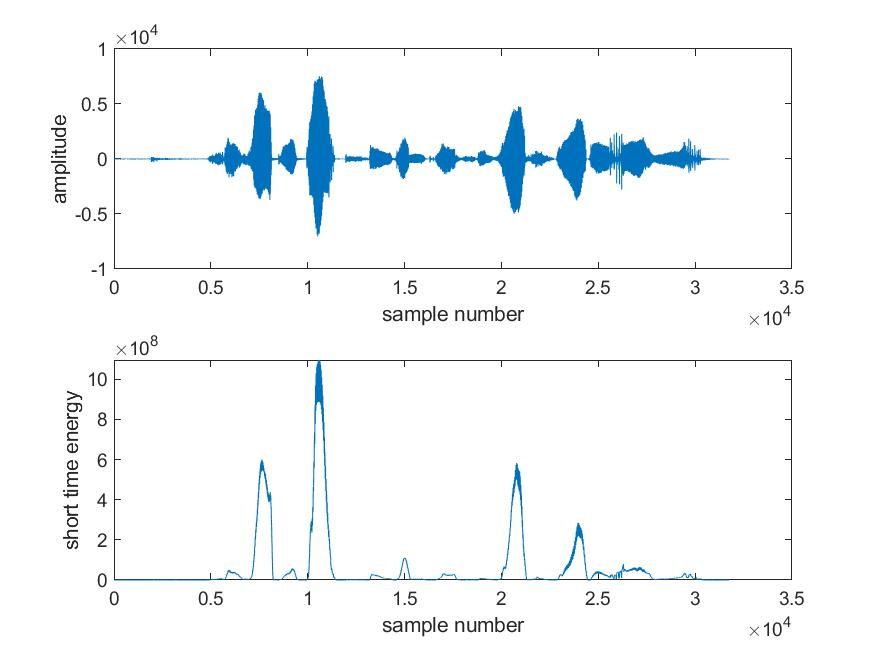
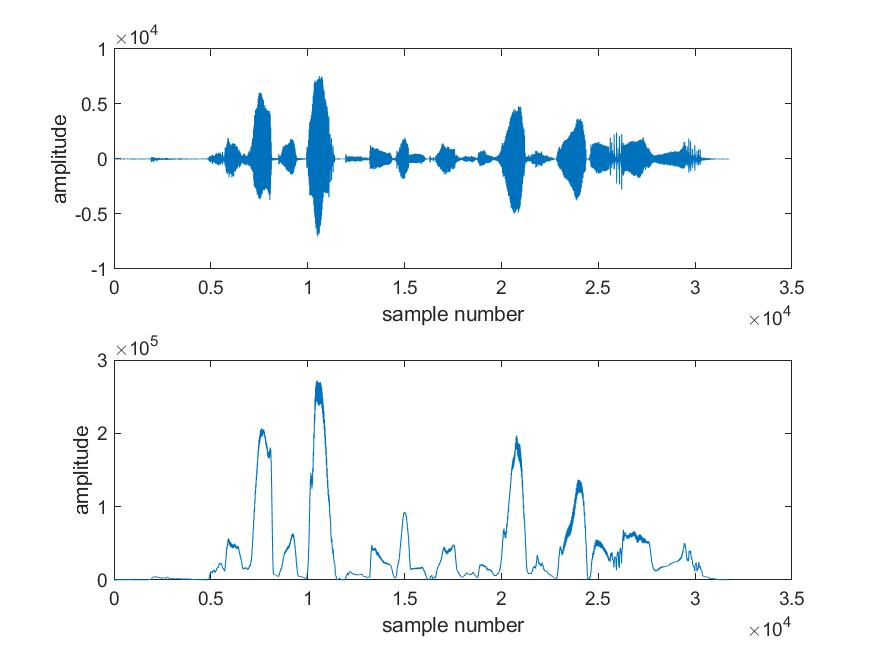
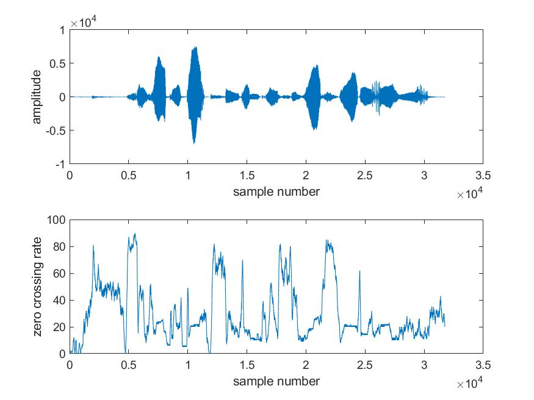
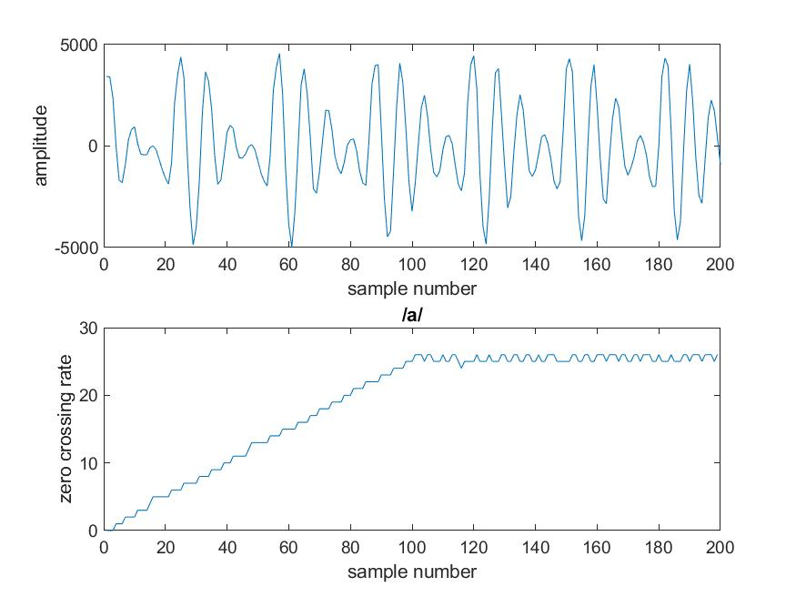
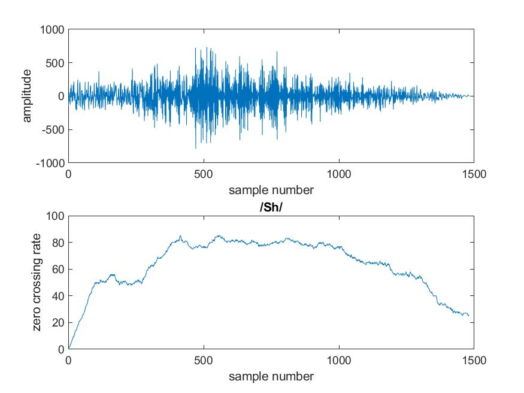
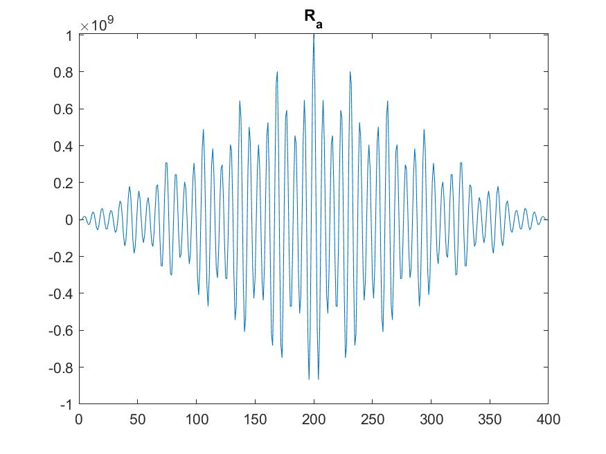
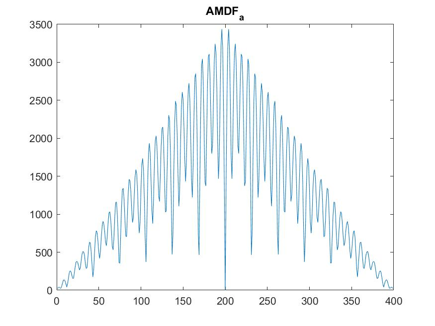
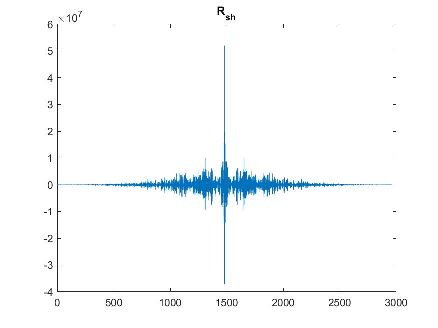
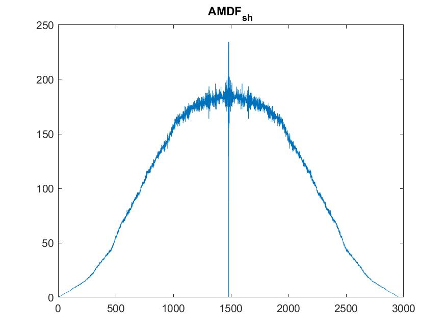

# Computer Assignmnet 2: Temporal Analysis of Speech

$$ \text{Name: Thomas Kost UID: 504989794}$$

## Abstract

In this assignment we will be using matlab to perform analysis on speech. We will investigate the uses of short-time energy analysis and the effect of window size. 

The code for each of the following sections is shown below. Note that each section is labeled as to which portion the code corresponds to:

```MATLAB
    %%
    %  File: CA_3.m
    % 
    %  Author: Thomas Kost
    %  
    %  Date: 26 October 2020
    %  
    %  @brief file to execute code for 3rd computer assignemnt of ECE114
    %
    close all;
    %% Short Time Energy Analysis
    one;
    soundsc(data, 8000);

    Fs = 8000;
    Nwn = 0.025*Fs;
    Nww = 0.003*Fs;
    figure;
    Q1  = time_analysis(data,'rectwin',Nwn,1);
    figure;
    Q2  = time_analysis(data,'rectwin',Nwn,2);
    figure;
    Q3  = time_analysis(data,'rectwin',Nwn,3);
    figure;
    Qa  = time_analysis(a   ,'rectwin',Nwn,3);
    figure;
    Qsh = time_analysis(sh  ,'rectwin',Nwn,3);
    
    
    Ra = xcorr(a,a);
    Rsh = xcorr(sh,sh);
    AMDFa = amdf(a);
    AMDFsh = amdf(sh);
    figure;
    plot(Ra);
    figure;
    plot(AMDFa);
    figure;
    plot(Rsh);
    figure;
    plot(AMDFsh);

    %% The Effect of Window Size
    load_in;
    Nw = 140;
    figure;
    zpfft(male_a,8000,8);
    figure;
    zpfft(female_a,8000,8);
    figure;
    zpfft(female_a(1:Nw),8000,8);
    
    figure;
    zpfft(male_a(1:Nw),8000,8);
```

## Short-time Energy Analysis
1. W3e can look at the plots for the amplitude compared with the short time energy plots and the anveratge amplitude (shown below respectively). Looking at these plots we can see that the plots can help to determine different types of sounds. We can identify silence as the region where both the amplitude and energy are quite near zero. Now we want to identify vowels and consonants. Vowels should contain large amounts of energy as they have a periodic signal in them, fricatives/consonants would expect to be more noise like (which is reduced in energy analysis). So we would expect vowels to occur where both the short-time energy and the amplitude have peaks. Consonants should occur when the energy plot is low but the amplitude plot registers a high value (or at least in comparison to the energy).



2. In looking at the plot of Q3 and the data (shown below) we can see that it should be possible to demarcate the difference between vowels, and silenc3e/noise/fircatives. This can be seen in that many of the large amplitude signals show very low number of zero crossings. As a result, we can see that vowels have much fewer zero crossings (as they are generally periodic signals at lower frequencies). We can look at the plots of /a/ and /sh/ (labeled below) to help determine this threshold. We can see that /a/ peaks at about 60 zero crossings per second--while, /sh/ peaks at 150 ZCR. As /Sh/ vary quickly jumps above 100, we can conclude that 100 ZCR would be a reasonable threshhold to determine wether or not something is a vowel. (anything nonzero below 100 is more likely be a vowel)




3. Shorter windows remove much of the smoothing that was seen on the plots of longer values. Too large values erase phenomena as they are averaging over far too long of a length.

4. The provided code was ran. The resulting plots are shown below. We can see that for both sounds the magnitude of  of the AMDF is significantly lower than that of the autocoorelation. We can also see that in both cases the general magnitudes show the same peaks and valleys in the autocoorelation as the AMDF function. It seems that the AMDF function shows similar peaks but also a rough envelope of magnitudes aswell. 






## The Effect of Window Size
1. The code in the appropriate section (shown in abstract) was ran. The window size was altered to determine the point at which the harmonics became no longer resolvable. For the femal voice, this occured at a size of less thatn 60 samples. For the male voice, this occured around a size of 140 samples. For the female recording this corresponds to a spectral resolution of 133.33Hz (which makes sense as this is about half the pitch). For the male recording this corresponds to a spectral resolution of 57.14 Hz (this also makes sense as the this is near half the pitch of the recording). Half the pitch is important as resolution smaller than that will allow the resonances to start to blend together as they will now bleed into each others bins. This makes them no longer resolvable.
