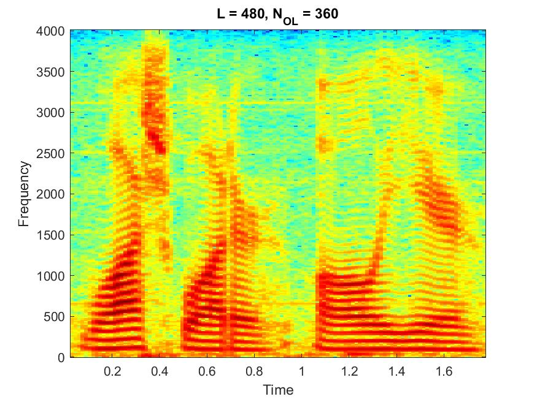
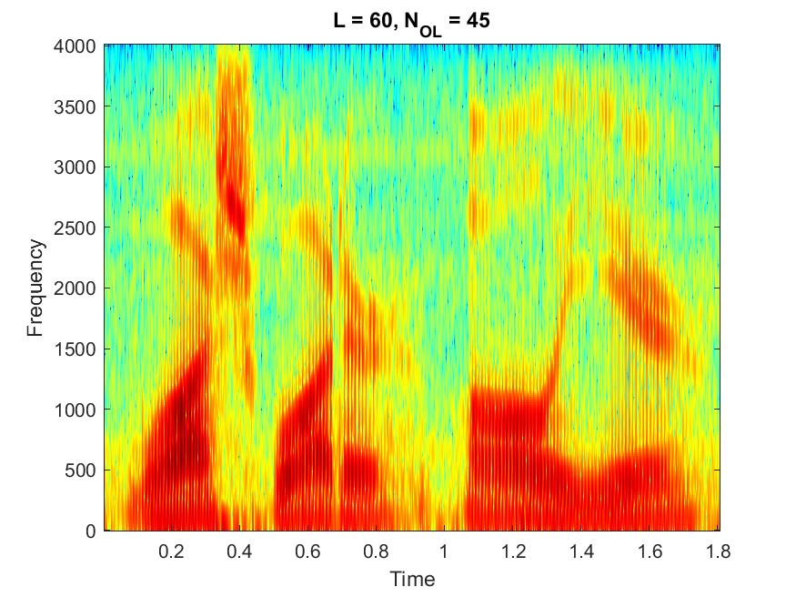

# Computer Assignmnet 4: Spectral Analysis of Speech

$$ \text{Name: Thomas Kost UID: 504989794}$$

## Abstract

In this assignment we will be investigating the use of a spectrogram to analyze speech in both the time domain and frequency domain. We will be investigating the effect of FFT and Overlap percentage on these plots. We will aslo be seeing the effect of the order of system we plan for in terms of Linear Prediction Analysis.

## Introduction

This assignemnt was completed with the aid of the code provided in the `CA4 files` folder. The matlab code that takes advantage of the provided code to solve the presented problems is shown below:

``` MATLAB

%%
 %  File: CA_4.m
 % 
 %  Author: Thomas Kost
 %  
 %  Date: 03 November 2020
 %  
 %  @brief Computer assignment concerning linear predictive analysis of voice
 %
 clc, clear, close all;

 %% Spectrograms
 % load in signals
 load_in;
 
 % variables with default values
 NFFT = 256;
 Fs   = 8000;
 L    = 256;
 N_OL = 128;
 
 
 tone_spectrogram = figure;
 soundsc(tone, 8000);
 specgram(tone,NFFT, Fs, L, N_OL);
 saveas(tone_spectrogram, "tone_spectrogram.jpg");
 
 sweep_spectrogram = figure;
 soundsc(sweep, 8000);
 specgram(sweep, NFFT, Fs, L, N_OL);
 saveas(sweep_spectrogram, "sweep_spectrogram.jpg");
 
 noise_spectrogram = figure;
 soundsc(noise, 8000);
 specgram(noise, NFFT, Fs, L, N_OL);
 saveas(noise_spectrogram, "noise_spectrogram.jpg");
 
 % Reevaluate paramaters
 NFFT = 512;
 L_values = [480, 240, 120, 60];
 N_OL_values = [360, 180, 90, 45];
 
 for n = 1:length(L_values)
     L = L_values(n);
     N_OL = N_OL_values(n);
     current_figure = figure;
     specgram(male_sentence, NFFT, Fs, L, N_OL);
     saveas(current_figure,...
         ['male_sent_' num2str(L) '_' num2str(N_OL) '.jpg']);
 end
 

 %% Linear Predictive Order
 
 % clean up workspace
 clear, clc, close all;
 
 % load in necessary data
 load_in;
 
 % declare variables
 Fs = 8000;
 fft_factor = 8;
 
 male_a_fft = figure;
 zpfft(male_a,Fs,fft_factor);
 saveas(male_a_fft, "male_a_zpfft.jpg");
 p = [4,6,8,10,12];
 for n =1:length(p)
      a =lpc(male_a,p(n));
      mag_plot = figure; 
      [h,w]=freqz(1,a);
      plot(w,20*log10(abs(h)));
      
      pole_zero_map = figure;
      pzmap(1,a);
      
      saveas(pole_zero_map, ['pole_zero_p' num2str(p(n)) '.jpg']);
 end
 p = 100;
 a =lpc(male_a,p);
 mag_plot = figure; 
 [h,w]=freqz(1,a);
 plot(w,20*log10(abs(h)));
 
 saveas(mag_plot, ['mag_plot_p' num2str(p) '.jpg'])

 ```

## Spectrogram Discussion 
### Signal Investigation
1. The spectrograms for the tone, sweep, and noise recordings are shown below. We can see that the tone has a single point of high amplitude frequency, that remains constant over time. This makes sense as the FFT of a single tone should roughly be an impulse function. For the sweep, we observe a similar phenopmena of a single large magnitude point per time step, but it travels diagonally. This makes sense as only  single tone frequency is present at any given time, but it increases in frequency as a function of time. Our noise plot looks quite chaotic. It is all rouighly a similar color with random values at each frequency and each time step--this makes sense as it is noise and (for AWGN) at lease is distributed across the entire spectrum evenly. Random variation is expected as it is noise. We can also see the rough size of the frequency bins aswell.


2. If L = 256, and $N_{OL}$ = 240 then the hop between FFT's is 16 samples. Therefore the hop is $\frac{N_{hop}}{N_{s}} = \frac{16}{8000} = 0.002$ seconds. Now that we have the period of the window for each FFT, we can invert the result to find the rate at which FFT's are being calculated. This gives us 500Hz.

### Window Length Effects
The plots for the FFT size set to 512 and the following paramaters ($L$, $N_{OL}$) = $[(480,360),(240,180),(120,90) ,(60,45)]$ are shown below and labeled as such. 






1. When the window length is long we have a much higher frequency resolution. The horizontal striations we see correspond to the peaks of each lobe making up the spectrum (resulting from delta train input of voiced sound). The distance between these striations can tell us the pitch of the sound.

2. When the window length is short we can see vertical striations in the spectrogram. These striations are caused by the frequency resolution being quite low. As a result each bin covers a wide range of frequencues and so the peaks around the formants blend together. When there is high amplitude this will result in a line.

3. The set of paramaters ($L$, $N_{OL}$) = $(120,90)$ seems to be the best as it smooths the plots enough for us to see the envelope and not simply horizontal striations, but it does not over smooth to create vauge vertical lines. It is much more clear where the formants are by solely looking at the peaks of this plot (over time).


## Linear Prediction Order

### Zpfft analysis

1. The zpfft script provides narrowband analysis. This is because we have a high resolution of our signal and can see more than the envelope (as shown below).


2. Looking at the spectum shown above we can estimate the first three formants to be at 753 Hz, 1184Hz, and 2403Hz. 


### LPC Analysis
The plots for p = [4,6,8,10,12,100] are shown and labeled below.
1. 6 poles provides the minimal number of formants required to model the first three formants. Seeing this plot we can see that this number of poles fairly accurately describes the formants of our system. Using this system our first three formants appear at 703Hz, 1179Hz, and 2476Hz. These values are quite close to the original signal.

2. We can see the plot of $p=100$ at the bottom of this document. This spectral representation still displays the formants, but it has far more peaks than formants that are present. As there are so many poles the ripples in the spectral representation correspond to the lobes present from the voiced sound. This is modeling the small peaks that we use to form the envelope, each small peak corresponds to the lobes present, and the distance between them is more related to pitch of our signal.


