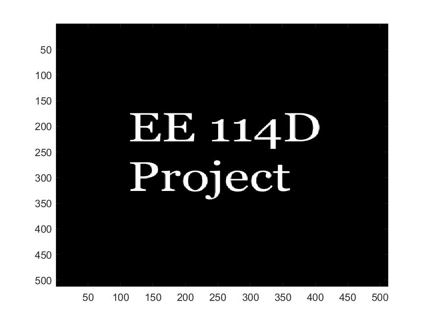

# Computer Assignment 5: 2-D Convolution

$$ \text{Name: Thomas Kost UID: 504989794}$$

## Abstract

In this assignment we will be using 2-D convolution to affect an image. This assignment will also use the operations performed on an image to investigate Peak Signal to Noise Ratio (PSNR).

## Introduction

In this assignment we will use matlab to perfom the assigned tasks. This is executed in the following code. Relevant parts of the assignment have been labeled as such in the code.

```MATLAB
%%
 %  File: CA_5.m
 % 
 %  Author: Thomas Kost
 %  
 %  Date: 23 November 2020
 %  
 %  @brief computer assignment for week 6
 %

 clear, clc, close all;
 
 %% Load and display image
 
 ca_5_image = imread("ca5_image.tiff");
 figure1 = figure;
 imagesc(ca_5_image);
 colormap(gray);
 
 %% Generate 2D gaussian distribution matrix
 
 lambda = 5;
 [m,n] = meshgrid(-20:20);
  H = exp(-(m.^2 +n.^2)/lambda);
  s = sum(sum(H));
  H= H/s; %normalize
  
%% Convolve image with gaussian matrix
 g = conv2(ca_5_image, H);
 blurred_im = figure;
 imagesc(g); 
 colormap(gray);
 dims = size(ca_5_image);
 rect = [21,21, dims(1)-1, dims(2)-1];
 g_prime = imcrop(g, rect);
 cropped_im = figure;
 imagesc(g_prime);
 colormap(gray);

 
 %% PSNR Calculation
 
 diff = g_prime - cast(ca_5_image, 'like', g_prime);
 error = sum(sum(diff.^2));
 scaled_error = error /(dims(1)*dims(2));
 PSNR = 10*log10(255^2/(scaled_error));
 fprintf('PSNR = %f \n', PSNR);
 
```

## Tasks
### Load and show Image

This was done in the above code. It is labeled as such. The results are shown below.



### Generate 2-Dimensional Gaussian Distribution Matrix
This is done in the `Generate 2D gaussian distribution matrix` section of the matlab code. 

### Convolve with Gaussian Distribution Matrix
This is done in the `Convolve image with gaussian matrix` of the matlab code. The result of this section of code running is shown below. Note, that indicies of [21,21] were determined to be the starting point for cropping the image as this is the origin of the filter. We can confirm this result by convolving a single 2-D delta function with out filter. 

We can see that the corresponding image produced from this result is a blurred version of the original image. The boundaries become less crisp. This makes sense as our filter is gaussian, and thus it will retain the center of the image on convoltion but spread it out from the central point with some standard deviation. This does not have much of an effect on the image within the text. But it stretches the text into the previously black region, creating a blurring effect.

### Measurement of Difference between Two images

In this section we implement the equation given for PSNR. This is carried out in the `PSNR Calculation` section of the matlab code. For the given conditions we found a PSNR of 25.387560. 

### More Blur

This section was done by changing the paramater `lambda` to 10. The results are shown below. We can see that increasing the lambda increases the blur. This makes sense as this will increase the variance of our gaussian distribution and cause each pixel to have a wider range of effect in the convolved result. This resulted in a PSNR of 23.120157. 
