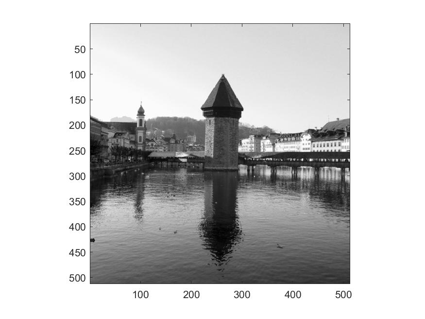
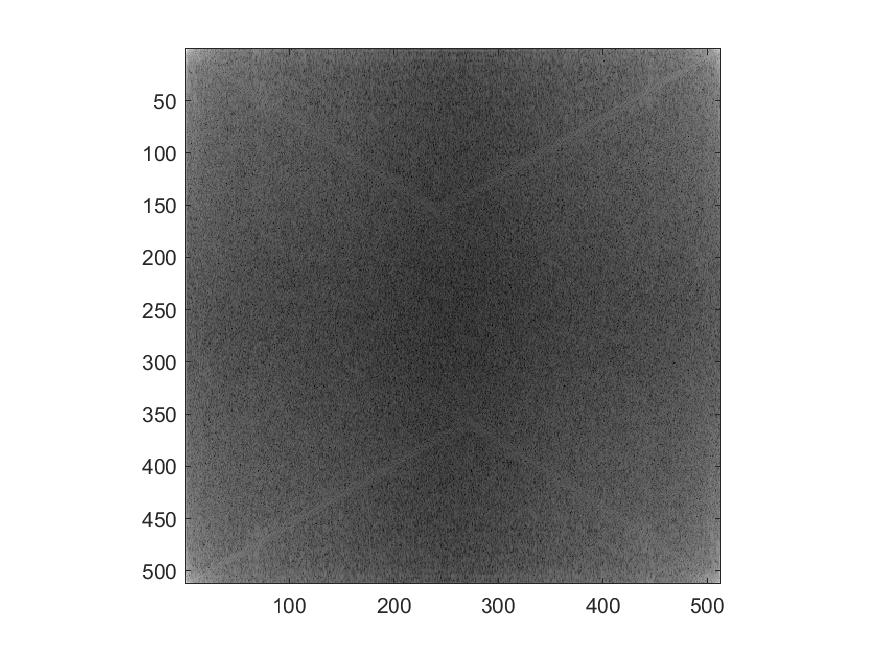
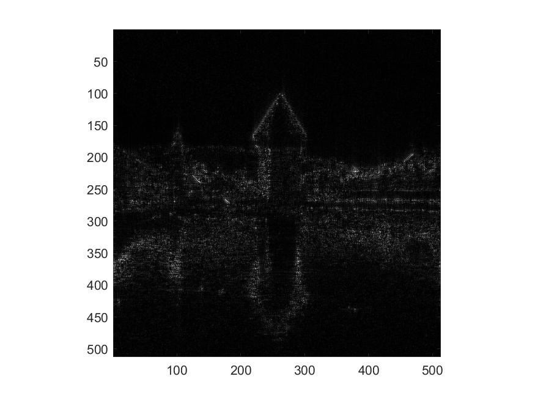
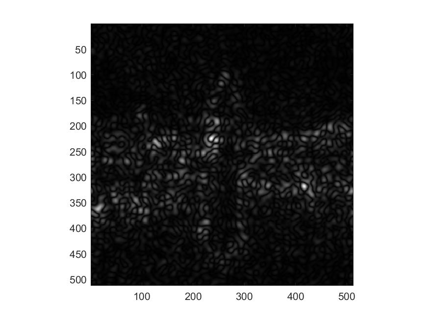

# Computer Assignment 6: 2-D DFT

$$ \text{Name: Thomas Kost UID: 504989794}$$

## Abstract

In this computer assignment we will be using the 2D fourier transform to analyze and modify images.

## Introduction
In this assignment we will use matlab to perfom the assigned tasks. This is executed in the following code. Relevant parts of the assignment have been labeled as such in the code.

```MATLAB
%%
 %  File: CA_6.m
 % 
 %  Author: Thomas Kost
 %  
 %  Date: 30 November 2020
 %  
 %  @brief computer assignment for week 7
 %

 clc, close all, clear;
 
 %% Display image and FT
 
 ca6_image = imread("ca6_image.tiff");
 figure1 = figure;
 imagesc(ca6_image);
 colormap(gray);
 axis square;
 saveas(figure1, "original.jpg");
 
 FT_img = fft2(ca6_image);
 maximum = max(max(FT_img));
 c =6;
 scaled_FFT = (log10((abs(FT_img)/maximum)+0.000001)+c)*(255/c);
 figure2 = figure;
 imagesc(scaled_FFT)
 colormap(gray);
 axis square;
 saveas(figure2, "scaled_fft.jpg");
 
 %% modify coefficients and observe the effects (and more processing)
 mod128 = wipe(FT_img,[-128,127]);
 mod64 = wipe(FT_img,[-64,63]);
 mod32 = wipe(FT_img,[-32,31]);
 
 mod128_IM = ifft2(mod128);
 figure3 = figure;
 imagesc(abs(mod128_IM));
 colormap(gray);
 axis square;
 saveas(figure3, "remove128.jpg");
 
 mod64_IM = ifft2(mod64);
 figure4 = figure;
 imagesc(abs(mod64_IM));
 colormap(gray);
 axis square;
 saveas(figure4, "remove64.jpg");
  
 mod32_IM = ifft2(mod32);
 figure5 = figure;
 imagesc(abs(mod32_IM));
 colormap(gray);
 axis square;
 saveas(figure5, "remove32.jpg");
 
  
 psnr128 = psnr(abs(mod128_IM), double(ca6_image),255);
 psnr64  = psnr(abs(mod64_IM), double(ca6_image),255);
 psnr32  = psnr(abs(mod32_IM), double(ca6_image),255);
 
 function val = origin_shift_x(coordinate)
     val = coordinate -(512/2);
 end
 function val = origin_shift_y(coordinate)
     val = (512/2)-coordinate;
 end
 function result = wipe(image,bounding_coordinate)
 %top left corner
 x_bound = bounding_coordinate(1);
 y_bound = bounding_coordinate(2);
 s = size(image);
 result = image;
 for i = 1:s(1)
     for j = 1:s(2)
         if(origin_shift_x(i) < x_bound)
             result(i,j) = 0.0001;
         elseif(origin_shift_x(i)> -x_bound -1)
             result(i,j) = 0.0001;
         elseif(origin_shift_y(j) > y_bound)
             result(i,j) = 0.0001;
         elseif(origin_shift_y(j) < (-y_bound-1))
             result(i,j) = 0.0001;
         end
     end
 end
 
 end

```

## Tasks

### Display image and its FT
In this section we display the image and its fourier transform. This is shown in the order listed below. Note that the fft displayed was scaled using the provided formula.



### Modify the Coefficients and Observe the Effects
For this section, we defined a `wipe` function to replace portions of the fft with 0.0001. This was used to replace the necessary indicies. The resulting image from the modified fft is shown below. The PSNR was 3.6868. This makes sense that this was fairly low, as the operation wiped out much of the low frequency data. We can see that our image contains mostly the edges of the original image, but this is logically not enough to create an SNR.



### More Processing
As we defined the function to carry out the removal of specific indicies in the fft, we simply had to call the function again to calculate the values for [-64,63] and [-32,31]. This is done in the `modify coefficients and observe the effects (and more processing)` section. The resulting images are shown below. They are what we would expect--as more data is removed, fewer high frequencies are left and the image becomes less recognizable. The calculated PSNRs are 3.6626 and 3.6555 respectively. Again, it makes sense that the PSNR is not high as the images only contain the high frequency edges of the original image. Additionally, we can see a slight decay in the values of the PSNR as more of the edges are removed by making the preserved portion of the FFT smaller (128-->64-->32). 


