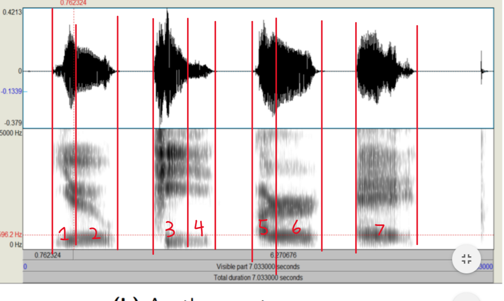
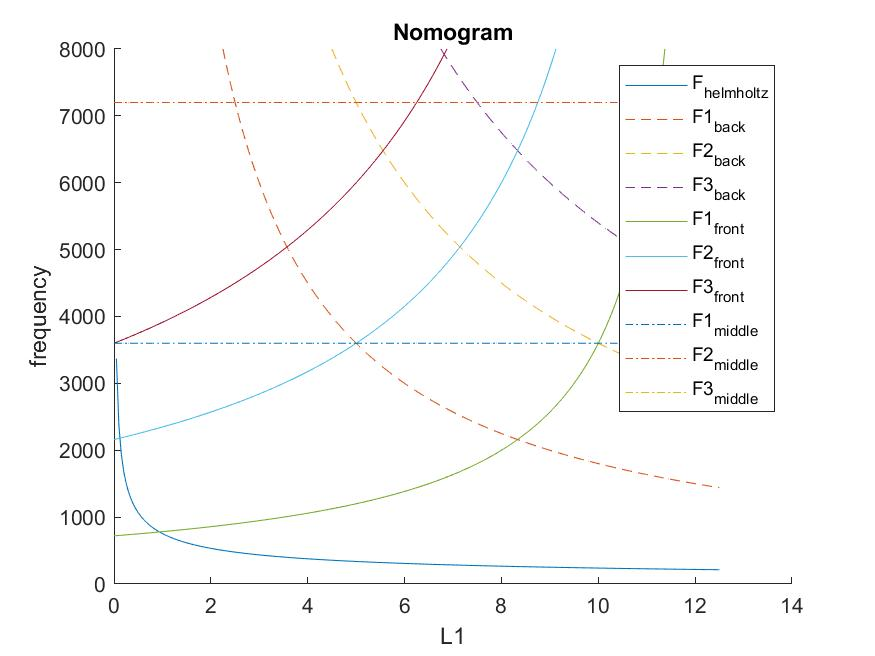
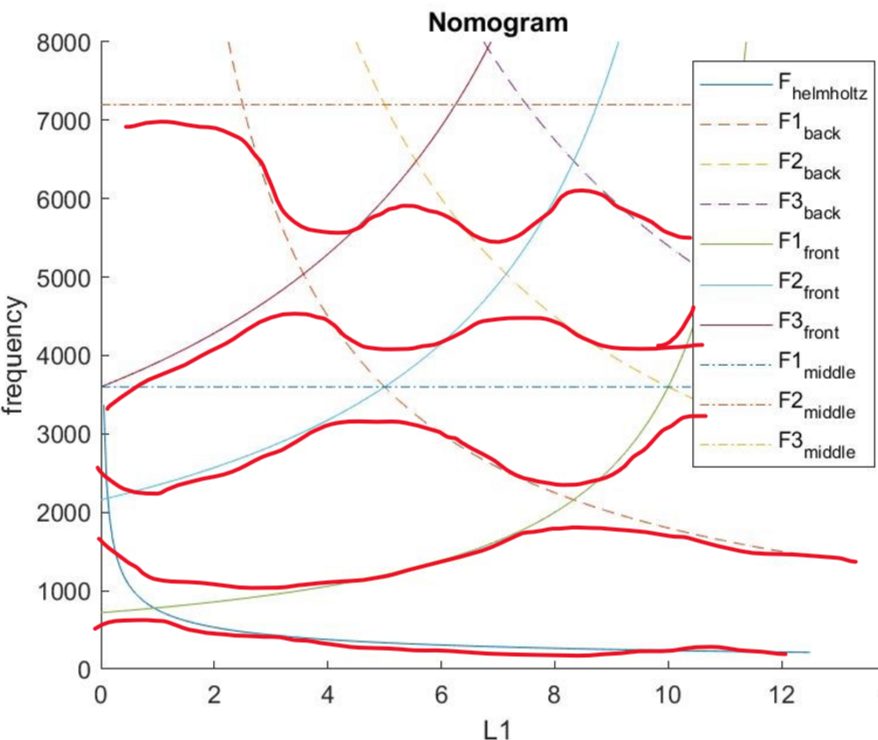
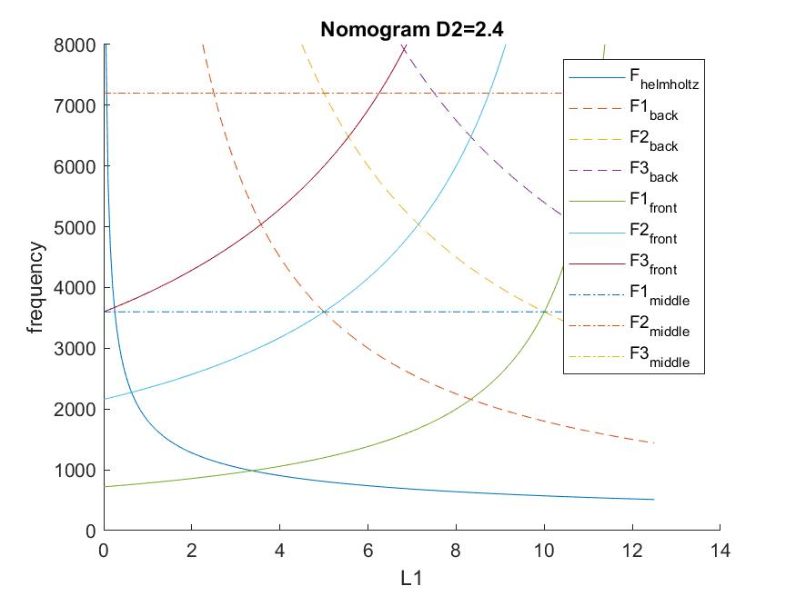

# Vocal Test ECE114

## Typed Explanations

## Question 1:

b) The image with the signal divided into phenomes is shown below. They are labeled as they are referenced in the handwritten portion.

d) The first two phenomes were pronounced incorrectly. This is beacuse the first phenome should be voiced and it does not have formants. additonally the second one drifts suggesting phenomes were not said right. (1,2 as labeled)
e) We know that spectrogram a is narrowband as we can see the horizontal striations caused by the pitch harmonics. This means that the spectrogram was taken with a longer length FFT( as it has greater frequency resolution) and as such is narrowband analysis. Conversely for spectrogram b, se only see vertical striations, and the frequncies blend together giving us a good descrition of the formants. This suggests a shorter length FFT was used, giving poorer frequency resolution. This is indicative of wideband analysis.

f) As stated the pitch resides between 119 and 149 Hz. This was done by counting the number of striations that occured in a given frequency range. As there is a red band labeling 596 Hz, we can count the number of strations on spectrogram A that occur between 0Hz and this value to find the approximate pitch. A range of pitches is given because at some points 4 strations were counted, while others seemed to suggest 5 were present. Counting the number of striations and dividing the frequency spanned by them by that number gives us the spacing between each of the striations. As the strations correspond to the pitch harmonics, getting the gap between them will determine the pitch. Using several strations helps to minimize our error in predicting pitch.

## Question 3:
a) The table of values requested is given on the hand written document. They are accompanied with the formulas used to derive them. For this problem, MATLAB was used to create the nomogram plots--shown below:

b) The revised nomogram taking into account accoustic coupoling is shown below:

c) Using the program written to plot the first nomogram, we can plot the second one with d2=2.4 -- shown below. This nomogram is largely the same in the formants produced by each of the tubes. However, The frequency of the helmholtz resonator changes quite a bit. This formant becomes much higher over all lengths of L1. 

d) using our calculations in the matlab model we can find the values shown, fromulas and reasoning shown in the handwritten section.

## Question 4

d) We know that there is only one formant in this model. This is because there is only one pair of complex conjugate poles. These poles will create a resonance in the system at a given frequncy, and as a result will create the peak we know as a formant. A calculation of the frequency of the formant is also shown on the handwritten section. 

It should also be noted that the fact that only one complex conjugate pair of poles exists came out of the face that our system was assumed to only have 3 poles at the beginning--making 1 pair the max number possible to be present. As a result this would not likely be a good model for our system.
