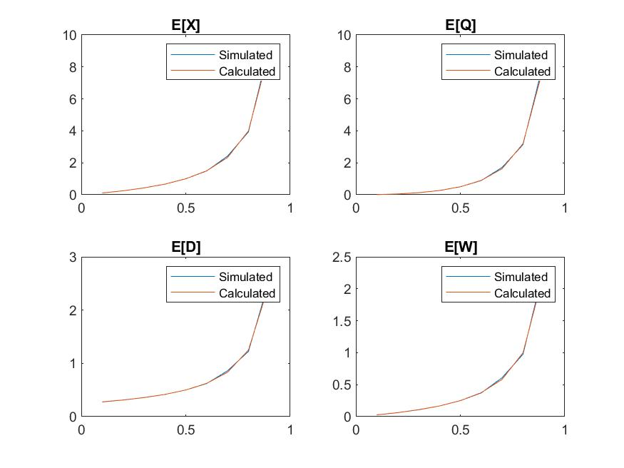

# Homework 6 Report

$$ \text{Thomas Kost}$$
$$ \text{UID: 504989794}$$
 
 ## Introduction

 This assignment has been completed using and modifying the code that was provided. The report will be broken down by question. The code will be referenced and labeled in the appendix section. It will also be present in a zip file turned in with the report. 

 ## 1A:

 In this problem we simulate the results of a M/M/1 Queuing system. Given the paramaters $\lambda$ and  $\mu$ we can calculate the analytical results using the provided equations from our class. We can also run the simulation for this case. 

 This yeilded the following results for $\lambda = 4$ and $\mu = 4$. First, our simulation resultin in the following values:
 $$ E[X] = 3.8004 $$
 $$ E[Q] = 3.0059 $$
 $$ E[D] = 0.94921 $$
 $$ E[W] = 0.75077 $$
 $$ System Utilization = 0.79445 $$
 
 Calulating the analytical values we find:
 $$ E[X] = 4.0000 $$
 $$ E[Q] = 3.20000 $$
 $$ E[D] = 1.00000 $$
 $$ E[W] = 0.80000 $$
 $$ System Utilization = 0.80000 $$

 As we can see the results of the analytcal method and the simulated method are quite close. This makese sense as we simulated our system with a high number of data points (law of large numbers would suggest a convergence towards the mean). We can see some varaince in the results, and again, this makes sense as these are simulated values, we would not expect to see perfect results. However, they are extremely close giving us faith that the code is implementing our system correctly. 

 ## 1B
 For this portion of the assignment we neeeded to make some architectural changes to the code. This can be seen in that the main function has been altered to be a function, and a new file named `run.m` has been added which will execute the main function with a given set of paramaeters. This allowed us to itteratively run the simulation and calculate analytical values to create the below plot. We can note that throughout all values of the system loading, the simulation results and the theoretical results remain close to one another.
 

## 2B
In implementing a M/M/2/3 queuing system we were able to simulate the behaviour of the system through making some changes to provided code. Note, all altered code has been prepended with `flow_control_*` in the file name. 
We were able to calculate the theoretical results of E[X], E[Q], E[W], and E[D]. The results of this are shown below (this is for the provided $\lambda = 9.8$ and $\mu = 5$). 
$$ E[X] = 1.6928 $$
$$ E[Q] = 0.2840 $$
$$ E[D] = 0.2394 $$
$$ E[W] = 0.0394 $$

In running the simulation i found the following results:
$$ E[X] = 2.6676 $$
$$ E[Q] = 1.049 $$
$$ E[D] = 0.32885 $$
$$ E[W] = 0.12932 $$
We can note that these results, while fairly close, are not exactly the same. Upon further investigation to the code, it appears to be a bug in the recording of statistics concerning the queeing system. That is--that through debugging the system and stepping through the various events, the queue is performing as intended and providing the correct flow control functionality. However, there seems to be a difficulty with matching the correct message to the correct departure time (and other timing related difficulties with the statistics).

## 2B
We can also calculate the blocking probability of the system both analytically and through simulation. We can see that the blocking probability can be theoretically calculated to be $ p_{b_{theory}} = 0.2783 $. In running our simulation we calculated the blocking probality in the following manner. Each time a message arrived, we made note of the event regardless wether it was admitted or not. Additionally, we kept track of the number of messages that were blocked. The ratio of the latter of these quantities to the first gives us our blocking probality. In our simulation we resulted in $P_b = 0.1691$. These results are clearly not identical, and suggest that the queuing system may be overly eagerly emtpying the queue, preventing more messages from being blocked. 

## Appendix
 This will be a rather lengthy section as it will detail all the code used in the project.

 **run.m**

 ```MATLAB
 clear, clc;
executing_var = [1,0,1];
%% 1A:
if executing_var(1)
    mu = 5;
    lambda = 4;
    rho = lambda/mu;
    [E_x_sim, E_q_sim, E_d_sim, E_w_sim,Sys_ut_sim] = main(mu,lambda);
    E_x_calc = rho/(1-rho);
    E_d_calc = 1/(mu*(1-rho));
    E_w_calc = rho/(mu*(1-rho));
    E_q_calc = (rho^2)/(1-rho);
end
%% 1B
if executing_var(2)
    mu = 4;
    p = [0.1:0.1:0.9];
    % simulated,calculated in column
    E_x_vals = zeros(2,length(p));
    E_q_vals = zeros(2,length(p));
    E_d_vals = zeros(2,length(p));
    E_w_vals = zeros(2,length(p));
    utiliztion = zeros(1,length(p));
    for i = 1:length(p)
        rho = p(i);
        [E_x_vals(1,i), E_q_vals(1,i), E_d_vals(1,i),...
            E_w_vals(1,i),utiliztion(i)] =  main(mu,mu*p(i));
        E_x_vals(2,i) = rho/(1-rho);
        E_d_vals(2,i) = 1/(mu*(1-rho));
        E_w_vals(2,i) = rho/(mu*(1-rho));
        E_q_vals(2,i) = (rho^2)/(1-rho);
    end
    figure1 = figure;
    subplot(2,2,1);
    plot(p, E_x_vals);
    legend("Simulated", "Calculated");
    title("E[X]");
    subplot(2,2,2);
    plot(p, E_q_vals);
    legend("Simulated", "Calculated");
    title("E[Q]");
    subplot(2,2,3);
    plot(p, E_d_vals);
    legend("Simulated", "Calculated");
    title("E[D]");
    subplot(2,2,4);
    plot(p, E_w_vals);
    legend("Simulated", "Calculated");
    title("E[W]");
    saveas(figure1, "1B_result.jpg");
end
%% 2A, 2B
if executing_var(3)
    mu = 5;
    lambda = 9.8;
    m = 2;
    N = 3;

    [E_x_sim_blocking, E_q_sim_blocking, E_d_sim_blocking, E_w_sim_blocking,...
        Sys_ut_sim_blocking, blocking_probability] = flow_control_main(mu,lambda, m, N);
    rho = lambda/(m*mu);
    f = lambda/mu;
    syms z;
    P0 = double((symsum((f.^z)/factorial(z), z, 0, m-1)+...
          symsum((f.^z)/(factorial(m)*m.^(z-m)), z, m, N))).^(-1);
    Pb = P0*(f.^N)/(factorial(m)*(m.^(N-m)));
    Pj = zeros(1,N+1);
    for i =0:N
        if i < m
            Pj(i+1) = P0*(f.^i)/(factorial(i));
        else
            Pj(i+1) = P0*(f.^i)/(factorial(m)*(m.^(i-m)));
        end
    end
    lambda_d = lambda*(1-Pb);
    E_x_calc_blocking = Pj*(0:N)';
    E_d_calc_blocking = E_x_calc_blocking/lambda_d;
    E_w_calc_blocking = E_d_calc_blocking - mu.^(-1);
    E_q_calc_blocking = 0;
    for i = m+1:N
        E_q_calc_blocking = E_q_calc_blocking + (i-m)*Pj(i);
    end
end
 ```

 **flow_control_main.m**
 
 ```MATLAB
 function [E_x_sim, E_q_sim, E_d_sim, E_w_sim,Sys_ut_sim,blocking_probability] = flow_control_main(mu, lambda, m, N)

    % The simulation of M/M/2/3 queueing system (QS)   
    %% Global parameters
    time_next_event(1:3) = 0;   % Events = {arrivals, departure ch1, departure ch2}
    num_events = 3;             % arrival and departure events for a G/G/1 QS

    mu =mu; % 1; 
    mean_service_time = 1/mu;      % Average message service time [sec]; 1/2 = 0.5 sec
    limit_customers = 100000;      % Maximum number of messages that arrive to the system (whether admitted or blocked) which induce termination of the simulation run
    Q_LIMIT = 1e30;  % The simulation program is terminated if the number of stored (in queue) messages exceeds this level
    % 1e30 denotes a high number (taken as infinity)

    lambda = lambda;%0.8;%0.5;
    rho = lambda/mu;
    mean_interarrival = 1/lambda; % Average interarrival time between message arrivals [sec];
    
    m = m; % number of channels
    N = N; % max size of queue
    %% Initialize the system's parameters
    flow_control_initialize;

    %% Main
    while total_of_customers-1 < limit_customers    % checks that the max number of served messages is below the specified limit and calls the timing( ) routine.
        % Also include termination conditions that involve maximum simulation run time, queue-size limits.
        % timing: Determines the next event type and updates the current simulation time
        timing;

        % update_time_avg_stats
        update_time_avg_stats;
        switch next_event_type
            case 1
                flow_control_arrive;            
            case 2
                departing_channel = 1;
                flow_control_depart; % channel 1
            case 3
                departing_channel = 2;
                flow_control_depart; % channel 2
        end
        %total_of_customers
    end
    % report
    report;
    blocking_probability = num_blocks/total_num_events;
end
 ```

 **flow_control_arrive.m**

 ```MATLAB
 time_next_event(1) = sim_time + exprnd(mean_interarrival);
num_in_s = num_in_s + 1;
if (num_in_q < N)
    time_arrival_system(num_in_s) = sim_time;       % time arrival system (i) = time of arrival of message-i
end                                                % time arrival system (num_in_s) = time of arrival of the last message to arrive
total_of_customers = total_of_customers + 1;
for channel = 1:m
    if (server_status(channel) == 1) && (channel==m)% busy is 1 and idle is 0                                              
        blocked = false;
        if(num_in_q < N)
            num_in_q = num_in_q + 1;                    %Server is busy, so increment number of customers in queue
        else
            blocked = true;
            num_blocks  = num_blocks + 1;
            total_of_customers = total_of_customers - 1; % remove as not admitted
            num_in_s = num_in_s - 1;
        end
        total_num_events = total_num_events + 1;
        
        % Check to see whether an overflow condition exists.
        if num_in_q > Q_LIMIT                       % Check to see whether termination condition is met:
                                                % The queue limit has been reached, so stop the simulation.
            display(['Simulation is intentionally stopped, something wrong. Overflow occurs at simu time = ' num2str(sim_time)]);
            return; 
        end
        if(num_in_q <= N) && ~blocked
            time_arrival_queue(num_in_q) = sim_time;
        end
    elseif server_status(channel) == 1
        continue;
    else % server_status == idle
        % Server is idle, so arriving customer has a delay of zero.
        % The following two statements are for program clarity and
        % do not affect the results of the simulation.
    
        wait_time = 0;
        total_of_waits = total_of_waits + wait_time;
    
        % Increment the number of customers delayed, and make server busy.
        num_waiting_custs = num_waiting_custs + 1;
        server_status(channel) = 1; % server is busy
    
        %Schedule a departure (service completion).
        time_next_event(1 + channel) = sim_time + exprnd(mean_service_time);
        
        total_num_events = total_num_events + 1;

        break;
    end
end
```

 **flow_control_depart.m**

 ```MATLAB
 num_in_s = num_in_s - 1;
delay_time = sim_time - time_arrival_system(1);         % delay experienced by the departing message
                                                        % time_arrival_system(1) identifies the time of arrival of the head-of-the-line (HOL) message.
total_of_delays = total_of_delays + delay_time;
num_delay_custs = num_delay_custs + 1;  

% push up message arrival times in the array so that the HOL message arrival time is at position 1
for k = 1:num_in_s
    time_arrival_system(k) = time_arrival_system(k+1);
end

if num_in_q == 0
    % The queue is empty so make the server idle and eliminate the
    % departure (service completion) event from consideration.
    server_status(departing_channel)     = 0;
    time_next_event(1+departing_channel) = 1.0e+30;    
else
    % The queue is nonempty, so decrement the number of customers in queue.
    num_in_q = num_in_q - 1;
    
    % Compute the delay of the customer who is beginning service and update
    % the total delay accumulator.
    wait_time = sim_time - time_arrival_queue(1);
    total_of_waits = total_of_waits + wait_time;
    
    % Increment the number of customers delayed,
    % and schedule next departure.
    num_waiting_custs = num_waiting_custs + 1;
    time_next_event(1+departing_channel) = sim_time + exprnd(mean_service_time);
    
    % Move each customer in queue (if any) up one place.
    for k = 1:num_in_q
        time_arrival_queue(k) = time_arrival_queue(k+1);
    end 
end


```

 **flow_control_initialize.m**

 ```MATLAB
     %% initialize
    sim_time = 0;               % Initialize simulation time  
    
    % Initialize the state variables
    server_status(1:m) = 0;          % idle status = 0; busy status = 1
    num_in_s = 0;               % number of customers in the system (or system size, denoted as X)
    num_in_q = 0;               % number of customers in the queue (wait size, denoted as Q)
    time_last_event = 0;        % the time of the latest recorded event
    departing_channel =0;       % determines which channel the departure will execute for
    % Initialize the statistical counters.
    num_waiting_custs = 0;      % cumulative number of customers that have experienced delay time up to this time
    num_delay_custs = 0;        % cumulative number of customers that have experienced waiting time up to this time
    total_of_customers = 0;     % Cumulative sum of the waiting times experience by all customers served by the system up to this time
    total_of_waits = 0;         % Cumulative sum of the waiting times experience by all customers served by the system up to this time
    total_of_delays = 0;        % Cumulative sum of the delay times experience by all customers served by the system up to this time
    area_num_in_s = 0;          % cumulative system size area up to this time
    area_num_in_q = 0;          % cumulative queue size area up to this time
    area_server_status = 0;     % cumulative service area up to this time
    
    num_blocks = 0;
    total_num_events = 0;
    % Initialize event list.  Since no customers are present,
    % the departure (service completion) event is eliminated from consideration.
    time_next_event(1) = sim_time + exprnd(mean_interarrival);  % time of next arrival event
    % Matlab defines exprnd(mean_interarrival) = exponentially distributed RV with this specified mean
    time_next_event(2) = 1e30;                                  % time of next departure event; 1e30 denotes infinite (channel 1)
    time_next_event(3) = 1e30;                                  % time of next departure event  (channel 2)
    
```

 **main.m**

 ```MATLAB
 function [E_x_sim, E_q_sim, E_d_sim, E_w_sim,Sys_ut_sim] = main(mu, lambda)

    % clear all;
    % clc; 

    % The simulation of M/M/1 queueing system (QS)   
    %% Global parameters
    time_next_event(1:2) = 0;   % Events = {arrivals, departures}
    num_events = 2;             % arrival and departure events for a G/G/1 QS

    mu =mu; % 1; 
    mean_service_time = 1/mu;      % Average message service time [sec]; 1/2 = 0.5 sec
    limit_customers = 100000;      % Maximum number of messages that arrive to the system (whether admitted or blocked) which induce termination of the simulation run
    Q_LIMIT = 1e30;  % The simulation program is terminated if the number of stored (in queue) messages exceeds this level
    % 1e30 denotes a high number (taken as infinity)

    lambda = lambda;%0.8;%0.5;
    rho = lambda/mu;
    mean_interarrival = 1/lambda; % Average interarrival time between message arrivals [sec];
    %% Initialize the system's parameters
    initialize;

    %% Main
    while total_of_customers-1 < limit_customers    % checks that the max number of served messages is below the specified limit and calls the timing( ) routine.
        % Also include termination conditions that involve maximum simulation run time, queue-size limits.
        % timing: Determines the next event type and updates the current simulation time
        timing;

        % update_time_avg_stats
        update_time_avg_stats;
        switch next_event_type
            case 1
                arrive();            
            case 2
                depart();
        end
        %total_of_customers
    end
    % report
    report;

end
```

 **timing.m**

 ```MATLAB
 min_time_next_event = 1.0e+29;
next_event_type = 0;    % Initial default value

for k = 1:num_events    % class-k event; k =1 designates an arrival event
    if time_next_event(k) < min_time_next_event
        min_time_next_event = time_next_event(k);
        next_event_type = k;
    end
    
    if next_event_type == 0 % i.e. when sim time is higher than 1.0e+29;
        sim_time
        break;
    end     
end

sim_time = min_time_next_event;
```
 **update_time_avg_stats.m**
 ```MATLAB
 time_since_last_event = sim_time - time_last_event;
time_last_event       = sim_time;


area_num_in_s = area_num_in_s + num_in_s*time_since_last_event;
% Update area under number-in-system function.
area_num_in_q = area_num_in_q + num_in_q*time_since_last_event;
% Update area under number-in-queue function.

% Update area under server-busy indicator function.
area_server_status = area_server_status + ...  
    server_status*time_since_last_event;
```

 **arrive.m**

 ```MATLAB
 time_next_event(1) = sim_time + exprnd(mean_interarrival);
num_in_s = num_in_s + 1;
time_arrival_system(num_in_s) = sim_time;       % time arrival system (i) = time of arrival of message-i
                                                % time arrival system (num_in_s) = time of arrival of the last message to arrive
total_of_customers = total_of_customers + 1;

if server_status == 1                           % busy is 1 and idle is 0                                              
    num_in_q = num_in_q + 1;                    %Server is busy, so increment number of customers in queue
    
    % Check to see whether an overflow condition exists.
    if num_in_q > Q_LIMIT                       % Check to see whether termination condition is met:
                                                % The queue limit has been reached, so stop the simulation.
        display(['Simulation is intentionally stopped, something wrong. Overflow occurs at simu time = ' num2str(sim_time)]);
        return; 
    end
    
    time_arrival_queue(num_in_q) = sim_time;

else % server_status == idle
    % Server is idle, so arriving customer has a delay of zero.
    % The following two statements are for program clarity and
    % do not affect the results of the simulation.
    
    wait_time = 0;
    total_of_waits = total_of_waits + wait_time;
    
    % Increment the number of customers delayed, and make server busy.
    num_waiting_custs = num_waiting_custs + 1;
    server_status = 1; % server is busy
    
    %Schedule a departure (service completion).
    time_next_event(2) = sim_time + exprnd(mean_service_time);
end
```

 **depart.m**
 
 ```MATLAB
 num_in_s = num_in_s - 1;
delay_time = sim_time - time_arrival_system(1);         % delay experienced by the departing message
                                                        % time_arrival_system(1) identifies the time of arrival of the head-of-the-line (HOL) message.
total_of_delays = total_of_delays + delay_time;
num_delay_custs = num_delay_custs + 1;  

% push up message arrival times in the array so that the HOL message arrival time is at position 1
for k = 1:num_in_s
    time_arrival_system(k) = time_arrival_system(k+1);
end

if num_in_q == 0
    % The queue is empty so make the server idle and eliminate the
    % departure (service completion) event from consideration.
    server_status      = 0;
    time_next_event(2) = 1.0e+30;    
else
    % The queue is nonempty, so decrement the number of customers in queue.
    num_in_q = num_in_q - 1;
    
    % Compute the delay of the customer who is beginning service and update
    % the total delay accumulator.
    wait_time = sim_time - time_arrival_queue(1);
    total_of_waits = total_of_waits + wait_time;
    
    % Increment the number of customers delayed,
    % and schedule next departure.
    num_waiting_custs = num_waiting_custs + 1;
    time_next_event(2) = sim_time + exprnd(mean_service_time);
    
    % Move each customer in queue (if any) up one place.
    for k = 1:num_in_q
        time_arrival_queue(k) = time_arrival_queue(k+1);
    end 
end


```