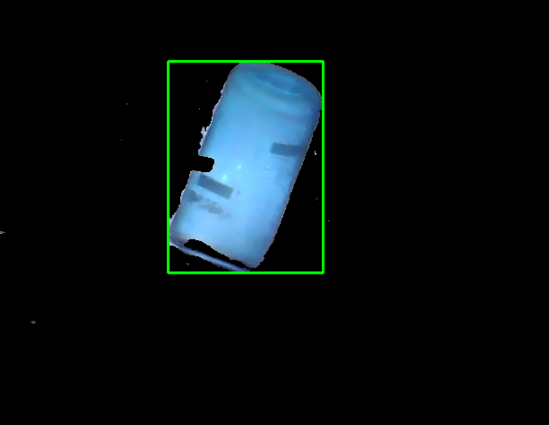
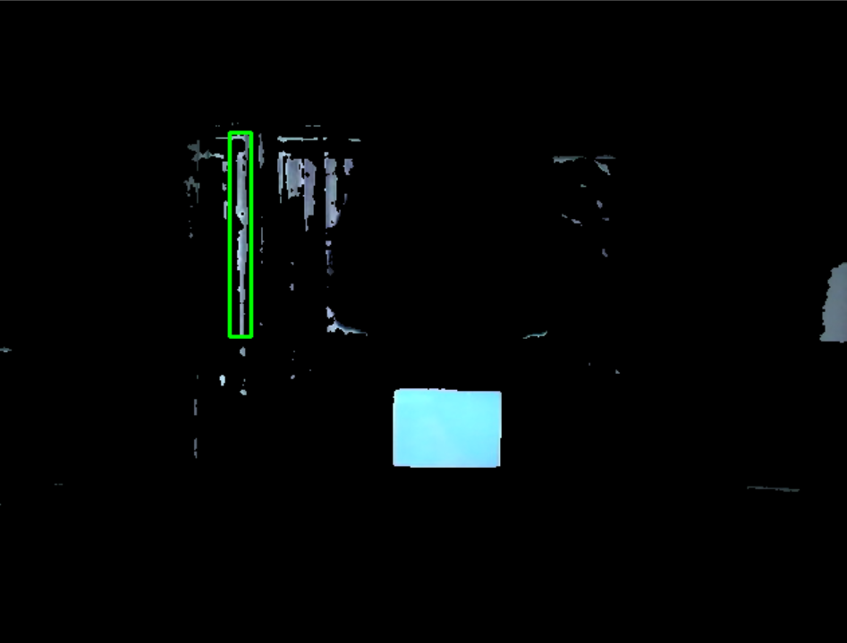

---
documentclass:
- article
geometry:
- top=1in
- left=1in
---

# ECE180DA : Lab 0 Report

$$\text{Thomas Kost}$$
$$UID:504989794$$

## Tasks Planned

This section will be used to describe the tasks that were intended to be completed this week.

- Github Setup
    - Simple CI/CD automations (doesnt have to do much for now)
    - Kanban Board and workflow specification
    - Clang format and clang-tidy for any C/C++/CUDA to be written
    - Start format for Wiki
    - Rough File Structure
- Purchase Hardware
- Project Brainstorming
- Run through Week 0 Tutorial

## Tasks Completed

This section will be used to describe the tasks that have been completed. The bullets will be accompanied with a brief description.

- Github has not yet been able to be setup as we have not been added as members on the repository yet. However, I have written many of the files, have a rough structure, and selected the simple inbuilt actions that we will want to start with for our setup.
- Suggested hardware has been ordered (raspberry pi zero W, required components for it, IMU, camera)
- Team settled on genral project idea--creating library of microservices for VR headsets. This would allow us to provide canned actions that can be integrated into any software. As the micro-sercives will bemodular, this will allow us to make a host of independent goals. Some examples would include gesture recognition
- I ran through the week zero tutorial. The results of this are described in the bullets listed below. 
    - A github repo for this tutorial has been made and can be viewed at : https://github.com/thomaskost17/180DA-WarmUp
    - I went throught the process of  installing conda on both windows and on WSL. Unfortunately WSL does not allow access to my camera, and so i was unable to use that installation for the process of this project. Additionally, it should be noted that the conda installer for linux systems does not add conda to the path automatically nor make the user owner of the file automatically. These issues needed to be manually fixed. 
    - A test python script was written as suggested, ran, and pushed to the github. No issues here.
    - A script for taking advantage of openCV for image processing was also written. Note a discussion of the questions asked in this task can be found below. This script made use of the resources listed to perform image tracking and color selection. This allowed me to track my waterbottle. Screenshots of the results can be seen in the task 4 discussion section.

### Task 4 Discussion
Choosing a nalgene water bottle  I was able to create a video stream where I tracked the water bottle. I was able to track the object and place a bounding box around it, as shown in the below image. All colors not being selected are blacked out in this image.

In doing this I noticed that HSV typically performes better. This makes sense considering that HSV is based more on the hue and brightness of an object. This allows us to more easily select a tight range of blues for the water bottle. RGB tended to get more easily confused.

I was able to get a threshold range of about 20 for the hue bottle. However, I needed to have a very large range for the saturation and value parameters because the bottle itself was quite shiny. As a result there were many reflected spots, making the image hard to track. 

In turning the lights on and off there was not a huge difference in the tracking of the water bottle. I think this is mostly due to the fact that the SV range is quite large.

Using a color picker I was able to see my phone by setting it to the appropriate HSV value.Changing the brightness either too high or too low makes it difficult to pick up the image. This can be seen as it is harder to track when the brightness was a little too high (shown in the image below). 

Unfortnately I was unable to complete the k-means part of the task. I was working on creating a region of intrest in which to plot colors from. However, conda was having an issue with the version of matplotlib it installed and importing the library would not work.

## Future Direction
- Get github setup with actions and workflow related nicities
- complete the week 1 tutorial
- get the k-means part of this week's tutorial working
- explore openCV more to see how it can apply to the creation of a library for VR
    - see if it will operate fast enough aswell, as speed could be a concern