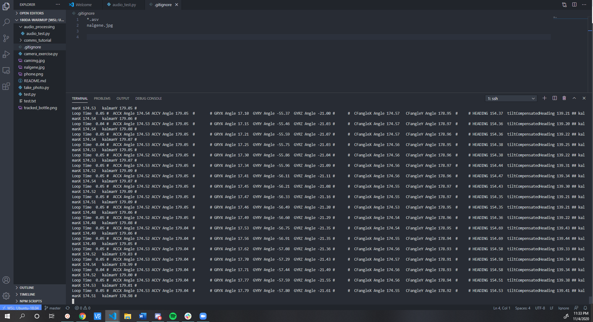

---
documentclass:
- article
geometry:
- top=1in
- left=1in
---

# ECE180DA : Lab 4 Report

 Thomas Kost |  UID:504989794

## Tasks Planned

- Complete IMU Tutorial
- Complete Midterm presentation and final project proposal
- Some reorganization of the github
- Hand tracker object 

## Tasks Completed
- IMU Tutorial completed
    - Ordered female to female cables for the IMU
    - Soldered headder pins onto IMU (careful to not damage any of the traces nearby the pins)
    - Setup BerryIMU on the raspberry pi with all dependencies
    - Recorded data with the IMU following steps dictated, evidence below

    
    
    - Played around with threshholding values to determine between two classes of movements
    - Planned out design for a more robust classifier
        - Record data on a sliding window (seems like 20 samples is reasonablegiven a 1 second window)
        - create labeled training set of various gestures (and garbage movements aswell)
        - use cvxpy and soft SVM to create decision boundaries for multiclass classification (either one v one or one v all)
        - can train on randomly error prone data aswell to increase robustness
        - actual interproduct should execute quite quickly
- Completed midterm presentation with team, discusses moving more in the direction of creating a virtual desktop (upon which the apps can be run on and act more as stretch goals)
- As midterm presentation helps to refine final project presentation these have been complementary tasks (the above task)
- created rough API for hand tracker (ensuring can interface well with Nico's image processing functions)

## Future Direction
- complete implementation of hand tracker
- write general script for training classifiers for our gesture recognition (and I suppose whatever else we would be inclined to classify)
    - go ML!
- make a do.sh script to handle linting with set of paramaters (not necessary rn just nice)
- start some preliminary integration depending on progress of others
